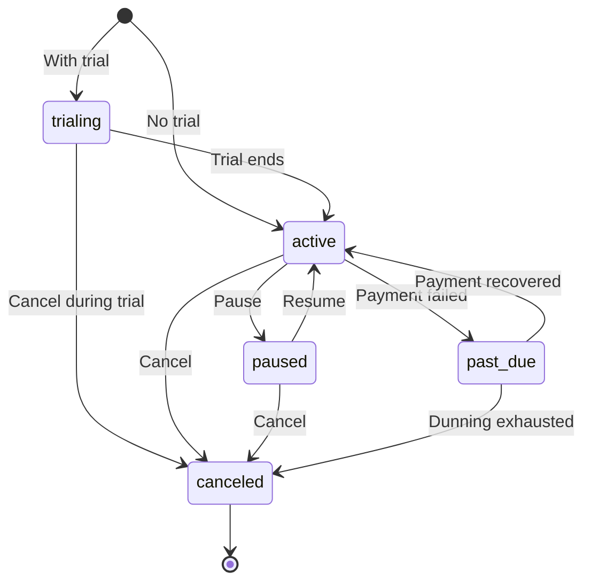
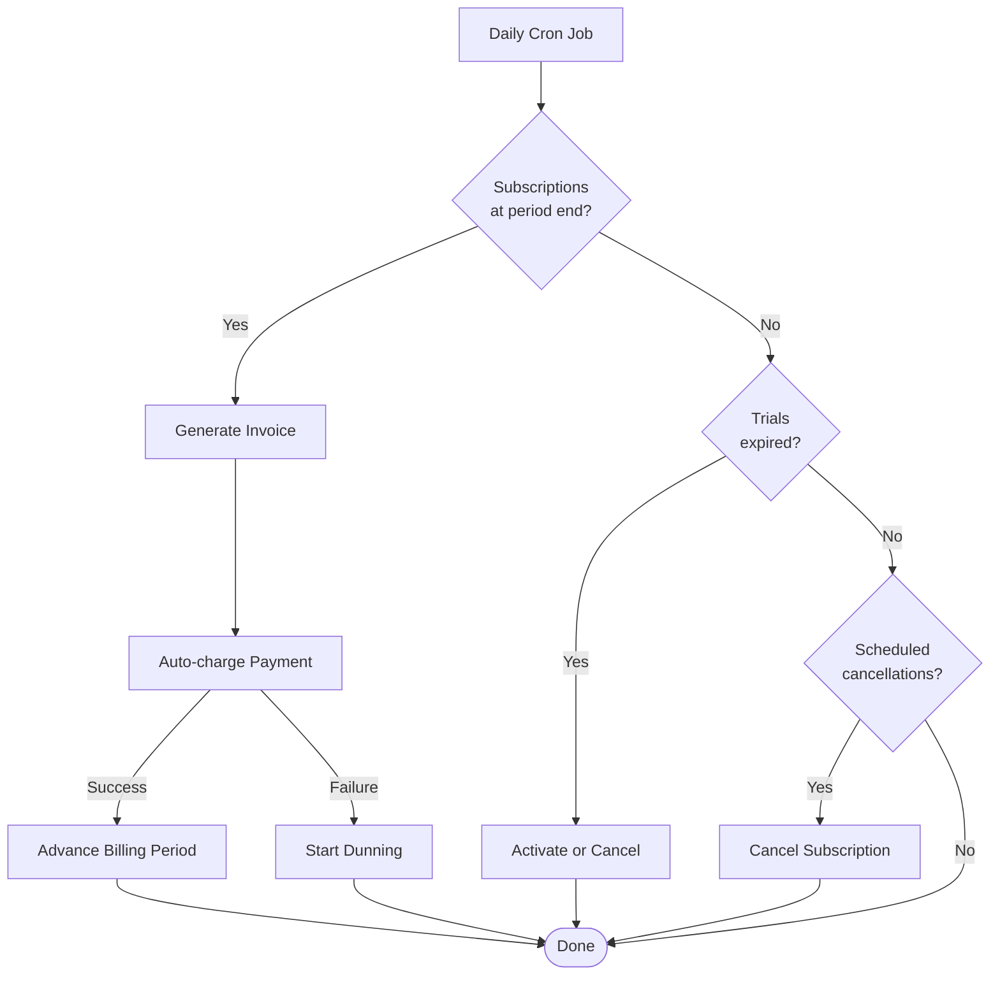

# Subscriptions API

Manage recurring billing subscriptions with plan changes, pausing, and cancellation.

## List Subscriptions

```http
GET /api/billing/subscriptions
```

**Response** `200 OK`

```json
[
  {
    "id": "01JQX...",
    "customerId": "01JQA...",
    "planId": "01JQB...",
    "status": "active",
    "billingCycle": "monthly",
    "currentPeriodStart": "2026-03-01T00:00:00Z",
    "currentPeriodEnd": "2026-04-01T00:00:00Z",
    "cancelAtPeriodEnd": false,
    "trialEnd": null,
    "createdAt": "2026-01-15T10:30:00Z"
  }
]
```

## Create Subscription

```http
POST /api/billing/subscriptions
Content-Type: application/json
```

**Body**

| Field | Type | Required | Description |
|---|---|---|---|
| `customerId` | UUID | Yes | Customer to subscribe |
| `planId` | UUID | Yes | Pricing plan |
| `billingCycle` | string | Yes | `monthly`, `quarterly`, or `yearly` |
| `trialDays` | integer | No | Trial period in days |
| `couponCode` | string | No | Discount coupon to apply |

**Response** `201 Created`

## Update Subscription

```http
PUT /api/billing/subscriptions/:id
Content-Type: application/json
```

| Field | Type | Description |
|---|---|---|
| `status` | string | `active`, `paused`, `canceled` |
| `cancelAtPeriodEnd` | boolean | Schedule cancellation at period end |

## Change Plan

```http
POST /api/billing/subscriptions/:id/change-plan
Content-Type: application/json
```

**Body**

| Field | Type | Required | Description |
|---|---|---|---|
| `newPlanId` | UUID | Yes | Target plan |
| `prorate` | boolean | No | Whether to prorate (default: true) |

Plan changes are prorated by default — a credit is issued for unused time on the old plan.

## Subscription Statuses



| Status | Description |
|---|---|
| `active` | Currently billing |
| `paused` | Temporarily suspended (no invoices generated) |
| `canceled` | Permanently canceled |
| `past_due` | Payment failed, in dunning |
| `trialing` | Within trial period |

## Lifecycle Automation



The subscription lifecycle cron job runs daily and:

1. Generates invoices for subscriptions reaching their period end
2. Advances billing periods
3. Expires trials
4. Processes scheduled cancellations
5. Triggers auto-charge for due invoices

See [Configuration](/getting-started/configuration) for cron schedule customization.
