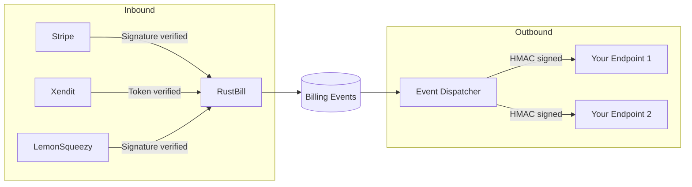

# Webhooks API

RustBill handles both **inbound** webhooks from payment providers and **outbound** webhooks to notify your systems of billing events.



## Inbound Webhooks

Payment providers send events to these endpoints. Each provider has its own signature verification.

### Stripe

```http
POST /api/billing/webhooks/stripe
Stripe-Signature: t=...,v1=...
```

Handles events: `checkout.session.completed`, `invoice.paid`, `invoice.payment_failed`, `customer.subscription.updated`.

### Xendit

```http
POST /api/billing/webhooks/xendit
x-callback-token: <webhook-token>
```

Handles events: `invoices.paid`, `invoices.expired`.

### LemonSqueezy

```http
POST /api/billing/webhooks/lemonsqueezy
X-Signature: <hmac-signature>
```

Handles events: `order_created`, `subscription_created`, `subscription_updated`, `subscription_payment_success`.

## Outbound Webhooks

Register endpoints to receive billing events from RustBill.

### Register Webhook Endpoint

```http
POST /api/billing/webhooks/endpoints
Content-Type: application/json

{
  "url": "https://your-app.com/webhooks/billing",
  "events": ["invoice.paid", "subscription.created", "payment.failed"],
  "secret": "your-signing-secret"
}
```

### List Endpoints

```http
GET /api/billing/webhooks/endpoints
```

### Update Endpoint

```http
PUT /api/billing/webhooks/endpoints/:id
```

### Delete Endpoint

```http
DELETE /api/billing/webhooks/endpoints/:id
```

## Event Types

| Event | Trigger |
|---|---|
| `subscription.created` | New subscription activated |
| `subscription.updated` | Status or plan change |
| `subscription.canceled` | Subscription canceled |
| `invoice.created` | New invoice generated |
| `invoice.paid` | Invoice payment received |
| `invoice.overdue` | Invoice past due date |
| `payment.succeeded` | Payment processed |
| `payment.failed` | Payment attempt failed |
| `license.created` | New license issued |
| `license.expired` | License reached expiration |
| `dunning.started` | Payment recovery initiated |
| `dunning.resolved` | Dunning resolved (payment received) |
| `dunning.failed` | All dunning attempts exhausted |

## Event Payload

```json
{
  "id": "evt_01JQX...",
  "type": "invoice.paid",
  "createdAt": "2026-03-15T10:30:00Z",
  "data": {
    "invoiceId": "01JQX...",
    "customerId": "01JQA...",
    "amount": "54.99",
    "currency": "USD"
  }
}
```

Outbound webhook requests include an `X-Signature` header with an HMAC-SHA256 signature of the payload using your endpoint's secret.
