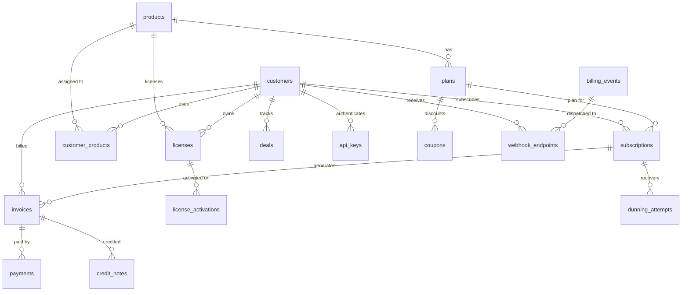

# Database Schema

RustBill uses PostgreSQL 17 with migrations managed by SQLx. All tables use UUID primary keys and `timestamptz` for timestamps.

## Entity Relationship Diagram



## Core Tables

### products

The product catalog. Supports three product types with type-specific nullable fields.

| Column | Type | Description |
|---|---|---|
| `id` | UUID | Primary key |
| `name` | VARCHAR(255) | Product name |
| `product_type` | product_type | `licensed`, `saas`, or `api` |
| `description` | TEXT | Optional description |
| `price` | DECIMAL(12,2) | Base price |
| `status` | VARCHAR(50) | `active`, `inactive`, etc. |
| `monthly_revenue` | DECIMAL(12,2) | Revenue tracking metric |
| `active_users` | INTEGER | MAU metric |
| `daily_active_users` | INTEGER | DAU metric |
| `churn_rate` | DECIMAL(5,2) | Churn percentage |

### customers

| Column | Type | Description |
|---|---|---|
| `id` | UUID | Primary key |
| `name` | VARCHAR(255) | Customer name |
| `email` | VARCHAR(255) | Unique email |
| `company` | VARCHAR(255) | Company name |
| `tier` | customer_tier | `starter`, `professional`, `enterprise` |
| `billing_address` | TEXT | Billing address |
| `tax_id` | VARCHAR(100) | Tax identifier |
| `payment_method` | payment_method | Default payment method |
| `health_score` | INTEGER | Customer health (0-100) |
| `credit_balance` | DECIMAL(12,2) | Store credit balance |

### subscriptions

| Column | Type | Description |
|---|---|---|
| `id` | UUID | Primary key |
| `customer_id` | UUID | FK to customers |
| `plan_id` | UUID | FK to plans |
| `status` | subscription_status | `active`, `paused`, `canceled`, `past_due`, `trialing` |
| `billing_cycle` | billing_cycle | `monthly`, `quarterly`, `yearly` |
| `current_period_start` | TIMESTAMPTZ | Start of current billing period |
| `current_period_end` | TIMESTAMPTZ | End of current billing period |
| `cancel_at_period_end` | BOOLEAN | Whether to cancel at period end |
| `trial_end` | TIMESTAMPTZ | Trial period end date |

### invoices

| Column | Type | Description |
|---|---|---|
| `id` | UUID | Primary key |
| `customer_id` | UUID | FK to customers |
| `subscription_id` | UUID | FK to subscriptions (nullable) |
| `invoice_number` | VARCHAR(50) | Unique human-readable number |
| `status` | invoice_status | `draft`, `issued`, `paid`, `overdue`, `void` |
| `subtotal` | DECIMAL(12,2) | Before tax |
| `tax_amount` | DECIMAL(12,2) | Tax total |
| `total` | DECIMAL(12,2) | Final amount |
| `currency` | VARCHAR(3) | ISO currency code |
| `due_date` | TIMESTAMPTZ | Payment due date |
| `paid_at` | TIMESTAMPTZ | When payment was received |
| `line_items` | JSONB | Array of line item objects |
| `pdf_url` | TEXT | Generated PDF location |

### licenses

| Column | Type | Description |
|---|---|---|
| `id` | UUID | Primary key |
| `license_key` | VARCHAR(255) | Unique license key string |
| `customer_id` | UUID | FK to customers |
| `product_id` | UUID | FK to products |
| `status` | VARCHAR(50) | `active`, `expired`, `revoked`, `suspended` |
| `max_activations` | INTEGER | Device activation limit |
| `current_activations` | INTEGER | Current active devices |
| `features` | JSONB | Licensed features map |
| `expires_at` | TIMESTAMPTZ | Expiration date |

## Enums

See the [Database Enums](/reference/database-enums) reference for all PostgreSQL enum types and their values.

## Migrations

Migrations live in the `migrations/` directory and are run automatically on server startup. They can also be run manually:

```bash
cargo sqlx migrate run
```

To create a new migration:

```bash
cargo sqlx migrate add <description>
```
