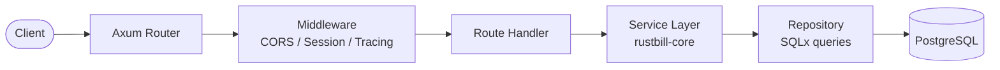
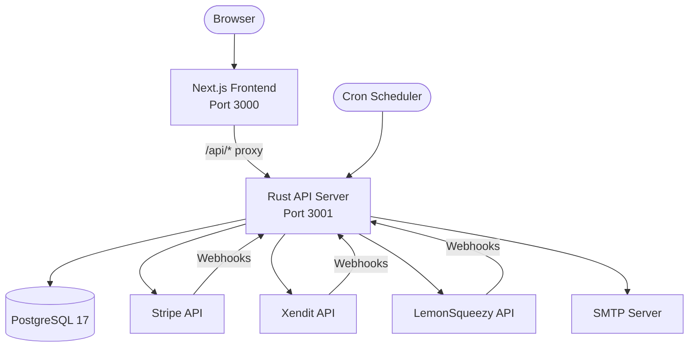
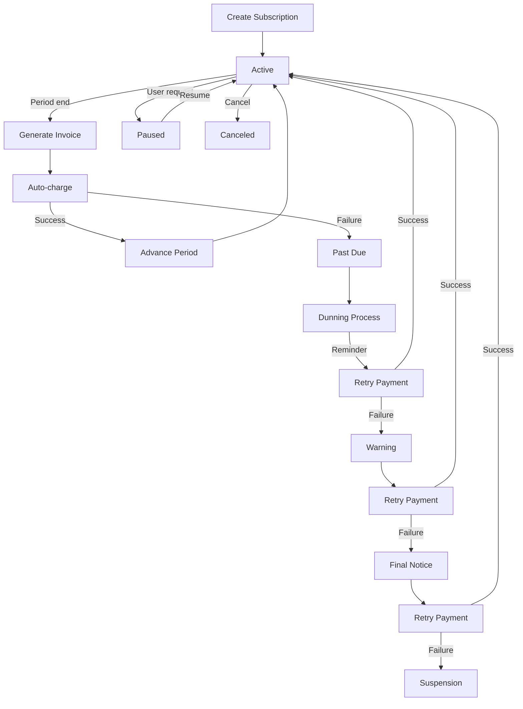

# Architecture Overview

RustBill follows a clean two-crate workspace architecture that separates business logic from HTTP transport.

## Workspace Structure

```
rustbill/
├── Cargo.toml                # Workspace root
├── config/                   # TOML configuration files
│   ├── default.toml
│   ├── development.toml
│   └── production.toml
├── migrations/               # SQL migration files (SQLx)
├── crates/
│   ├── rustbill-core/        # Domain logic & services
│   │   └── src/
│   │       ├── billing/      # Subscription lifecycle, invoicing, payments, dunning
│   │       ├── customers/    # Customer management
│   │       ├── products/     # Product catalog
│   │       ├── licenses/     # License key management
│   │       ├── payments/     # Payment provider integrations
│   │       ├── auth/         # Authentication & session management
│   │       ├── notifications/# Email, webhooks, event emission
│   │       ├── scheduler/    # Cron job management
│   │       ├── search/       # Full-text search
│   │       ├── settings/     # Admin settings & provider config
│   │       ├── analytics/    # Sales ledger & metrics
│   │       ├── deals/        # Deal tracking
│   │       ├── db/           # Database models & pool
│   │       ├── config.rs     # Configuration loading
│   │       └── error.rs      # Unified error types
│   └── rustbill-server/      # HTTP layer
│       └── src/
│           ├── app.rs        # Router setup & middleware
│           ├── routes/       # Axum route handlers (vertical slices)
│           └── main.rs       # Entry point
└── docker-compose.yml
```

## Design Principles

### Vertical Slice Architecture

Routes are organized as **vertical slices** -- each feature module contains its own route handlers, request/response types, and validation logic. This keeps related code co-located rather than scattered across layers.

### Repository + Service Pattern

The core crate follows a repository-service pattern:
- **Repositories** handle database queries via SQLx with compile-time checked SQL
- **Services** compose repositories with business logic, validation, and side effects
- **Route handlers** are thin -- they deserialize requests, call services, and serialize responses

### Feature Gates

Payment provider integrations are behind Cargo feature flags:

```toml
[features]
default = ["xendit", "lemonsqueezy"]
stripe = ["dep:async-stripe"]
xendit = []
lemonsqueezy = []
```

This allows building only the providers you need, reducing binary size and compile time.

## Request Flow



## System Architecture



## Billing Lifecycle



## Key Design Decisions

- **SQLx compile-time queries** -- SQL is verified at compile time against the database schema, catching errors before runtime
- **Axum extractors** -- Authentication is enforced via `AdminUser` and `ApiKeyUser` extractors, making it impossible to forget auth checks
- **Decimal arithmetic** -- All monetary values use `rust_decimal` to avoid floating-point errors
- **ULID primary keys** -- Sortable, URL-safe identifiers used for all entities
- **Tower middleware** -- Request tracing, CORS, and rate limiting composed via Tower's service pattern
