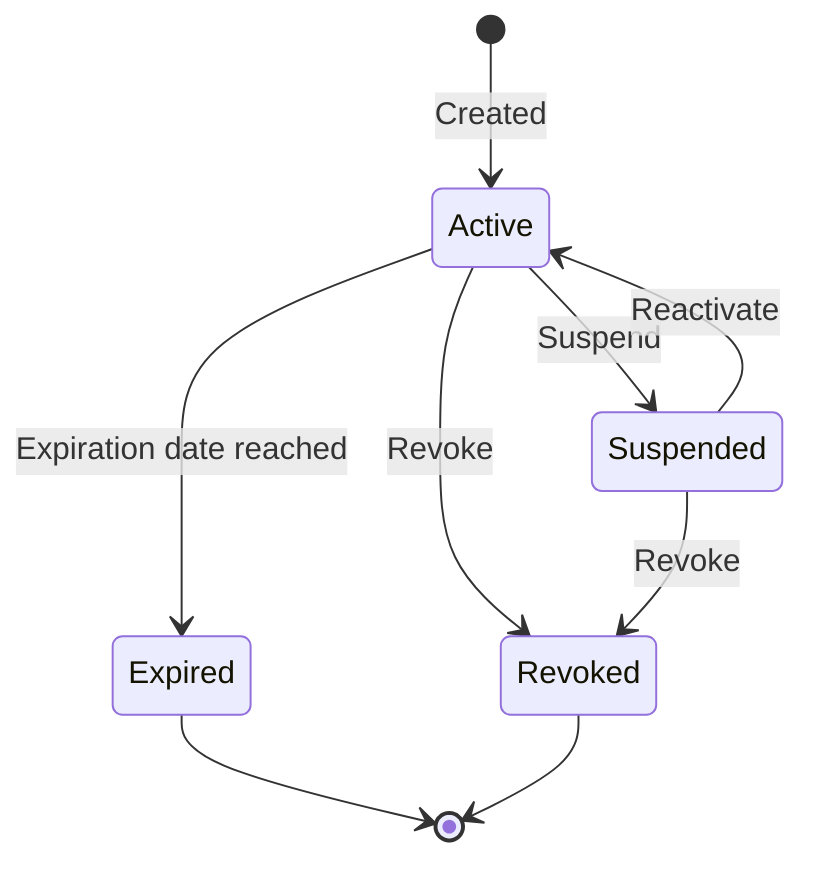

# License Management

RustBill provides a complete license management system for distributing and validating software licenses.

## Overview

The license system supports:
- Auto-generated unique license keys
- Per-device activation tracking with configurable limits
- Feature-based licensing (boolean flags and numeric limits)
- Expiration dates
- Public verification endpoints (no auth required)

## Creating Licenses

### Admin API

```http
POST /api/licenses
Content-Type: application/json

{
  "customerId": "01JQA...",
  "productId": "01JQB...",
  "maxActivations": 3,
  "features": {
    "api_access": true,
    "premium_support": true,
    "max_users": 50,
    "modules": ["analytics", "reporting", "export"]
  },
  "expiresAt": "2027-01-15T00:00:00Z"
}
```

### Key Format

License keys are auto-generated in the format:

```
RUSTBILL-XXXX-XXXX-XXXX
```

Keys are unique and indexed for fast lookup.

## Integrating License Checks

### Basic Verification

Call the public verify endpoint from your software:

```http
POST /api/licenses/verify
Content-Type: application/json

{
  "licenseKey": "RUSTBILL-XXXX-XXXX-XXXX"
}
```

**Response:**

```json
{
  "valid": true,
  "status": "active",
  "features": {
    "api_access": true,
    "max_users": 50
  },
  "expiresAt": "2027-01-15T00:00:00Z"
}
```

This endpoint is public (no authentication required) so your software can call it directly.

### Activation-Based Validation

For per-device licensing, use the validate endpoint:

```http
POST /api/licenses/validate
Content-Type: application/json

{
  "licenseKey": "RUSTBILL-XXXX-XXXX-XXXX",
  "deviceId": "hw-fingerprint-abc123",
  "deviceName": "John's MacBook Pro"
}
```

This:
1. Verifies the license is valid
2. Checks if the device is already activated
3. If new, registers the activation (if under limit)
4. Returns validation result

**Error when limit reached:**

```json
{
  "valid": false,
  "error": "activation_limit_reached",
  "maxActivations": 3,
  "currentActivations": 3
}
```

## Managing Activations

### View Activations

```http
GET /api/licenses/:key/activations
```

### Revoke Activation

```http
DELETE /api/licenses/:key/activations/:deviceId
```

Useful when a customer replaces a device.

## License Lifecycle



| Status | License checks return | Can activate |
|---|---|---|
| `active` | `valid: true` | Yes |
| `suspended` | `valid: false` | No |
| `expired` | `valid: false` | No |
| `revoked` | `valid: false` | No |

## Best Practices

1. **Cache verification results** — Don't call the verify endpoint on every app launch. Cache for 24-48 hours with a background refresh.
2. **Graceful degradation** — If the license server is unreachable, use the cached result. Don't lock out paying customers due to network issues.
3. **Device fingerprinting** — Use a stable hardware identifier (machine ID, disk serial) rather than volatile identifiers (IP address, hostname).
4. **Feature flags** — Use the `features` field to control access to specific modules rather than creating multiple licenses per customer.
